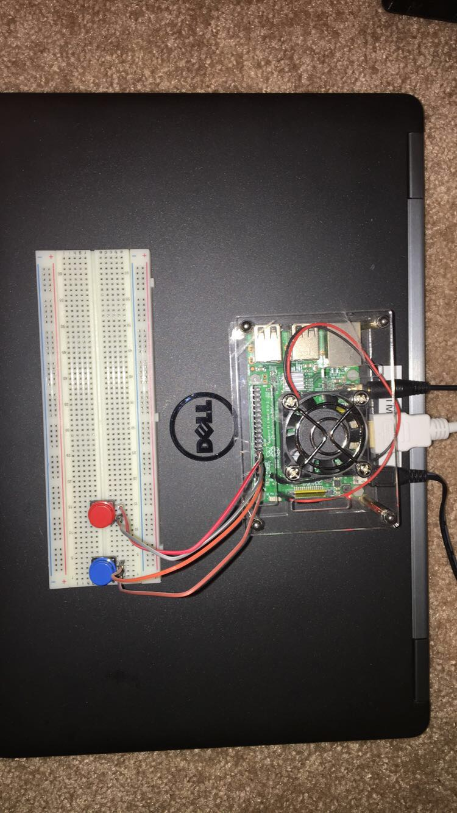

**UPDATE: 01/10/2018**

I have released Achoo beta version 0.1! Check it out at [achoo.us](https://achoo.us). Also, check out the [blog post about it](https://tmthyjames.github.io/tools/prediction/Achoo-beta-0.1/). Most of the info below is now obsolete and will be replaced shortly as Achoo is now a web app for users instead of just a repo for devs :) 

Achoo uses a Raspberry Pi to predict if my son will need his inhaler on any given day using weather, pollen, and air quality data. If the prediction for a given day is above a specified threshold, the Pi will email his school nurse, and myself, notifying her that he may need preemptive treatment. **TUTORIAL COMING SOON**

Prompted by [this](https://www.reddit.com/r/Python/comments/70udwq/what_routine_tasks_do_you_automate_with_programs/) reddit post. Lots of great ideas in there.

### Here's my Pi setup (obsolete as this is all done through the app now)

Blue button is for inhaler (first line of defense)

red button is for breathing treatment (second line of defense; use this one if his symptoms are really bad)

